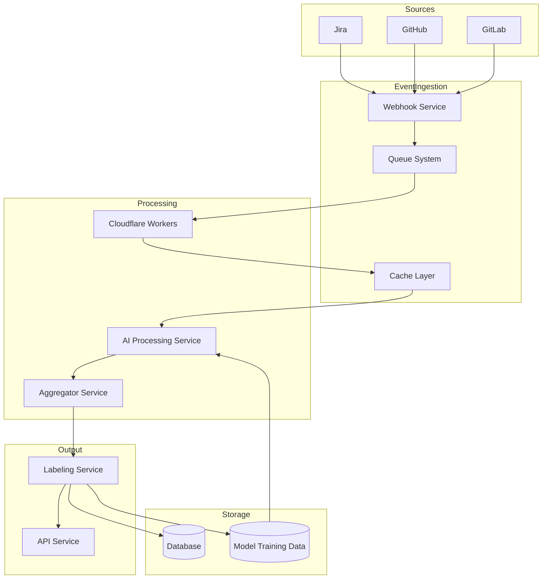

# labelit.ai

## Architecture

## TODO

- [ ] Webhook security
  - [ ] Github
  - [ ] Gitlab
  - [ ] JIRA
- [ ] Unit testing
  - [ ] AI
  - [ ] Config
  - [ ] Service
  - [ ] Types
  - [ ] Utils
  - [ ] Webhook
  - [ ] Worker
- [ ] Integrations
  - [ ] Apps
    - [ ] Github
    - [ ] Gitlab
    - [ ] JIRA
  - [x] Knip
  - [x] Turborepo
