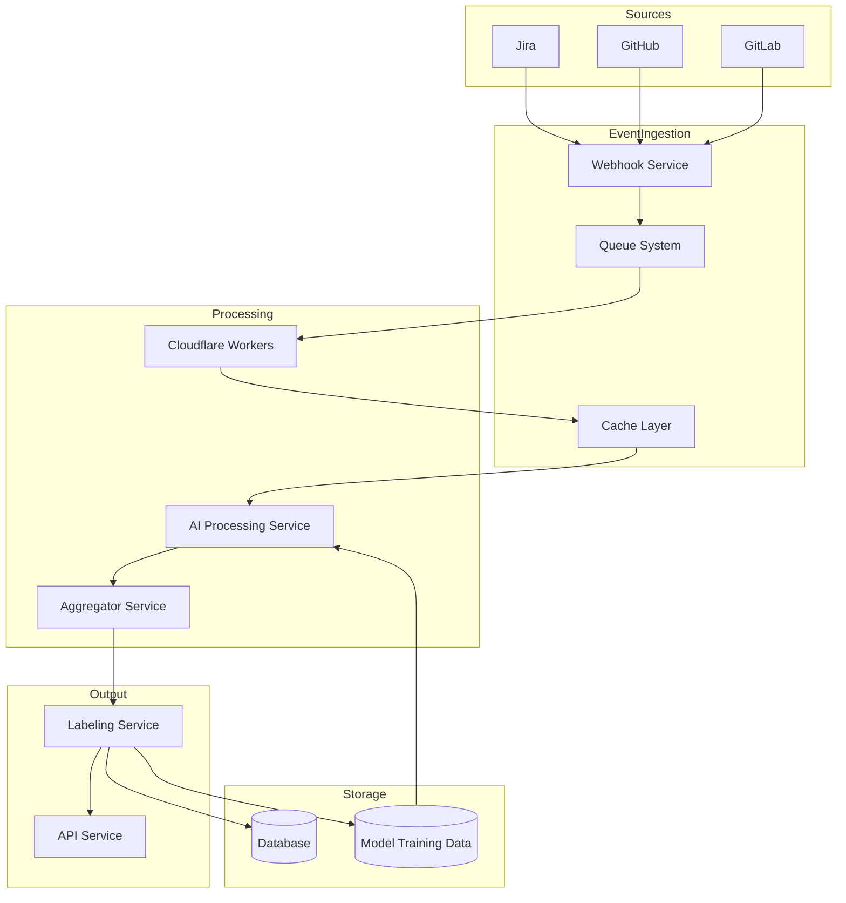

# labelit.ai

[](https://oxlint.github.io/)
[](https://github.com/rjoydip/labelit.ai/actions/workflows/ci.yml)
[](https://www.npmjs.com/package/labelit.ai)
[](https://opensource.org/licenses/MIT)
[](https://www.typescriptlang.org/)

## Overview

labelit.ai is a monorepo platform for processing webhook events from various sources (Jira, GitHub, GitLab) and applying AI-powered labeling to issues and pull requests. The system uses Cloudflare Workers for event ingestion, Turborepo for monorepo management, and Bun as the package manager.

## Architecture


```mermaid
flowchart TD
    subgraph Sources
        BB[Jira]
        GH[GitHub]
        GL[GitLab]
    end

    subgraph EventIngestion
        WH[Webhook Service]
        Q[Queue System]
        C[Cache Layer]
    end

    subgraph Processing
        CF[Cloudflare Workers]
        AI[AI Processing Service]
        AGG[Aggregator Service]
    end

    subgraph Storage
        DB[(Database)]
        ML[(Model Training Data)]
    end

    subgraph Output
        LAB[Labeling Service]
        API[API Service]
    end

    BB --> WH
    GH --> WH
    GL --> WH
    WH --> Q
    Q --> CF
    CF --> C
    C --> AI
    AI --> AGG
    AGG --> LAB
    LAB --> DB
    LAB --> ML
    LAB --> API
    ML --> AI
```

## Project Structure

```
labelit.ai/
├── packages/
│   ├── ai/          # AI processing service
│   ├── config/      # Shared configurations
│   ├── services/    # Core business logic services
│   ├── types/       # Shared TypeScript types
│   ├── utils/       # Utility functions
│   └── worker/      # Cloudflare Worker service
├── .github/         # GitHub workflows
├── scripts/         # Utility and maintenance scripts
├── docs/            # Documentation
├── README.md
├── package.json
├── turbo.json
└── webhook.ts
```

## Getting Started

### Prerequisites

- [Bun](https://bun.sh/) (version 1.1.3 or later)
- Node.js 18+ (for compatibility)
- Git

### Installation

1. Clone the repository:

   ```bash
   git clone https://github.com/yourusername/labelit.ai.git
   cd labelit.ai
   ```

2. Install dependencies:
   ```bash
   bun install
   ```

### Development

Run the development server:

```bash
bun run dev
```

This will start all packages in development mode using Turborepo.

### Available Scripts

In the root `package.json`:

- `bun run dev` - Start development mode for all packages
- `bun run build` - Build all packages for production
- `bun run lint` - Lint all packages (using oxlint after migration)
- `bun run test` - Run tests for all packages
- `bun run typecheck` - Type check all packages
- `bun run webhook` - Run the webhook service directly
- `bun run update` - Update all dependencies

### Package-Specific Scripts

Each package may have additional scripts defined in their respective `package.json` files.

## Technology Stack

- **Monorepo Manager**: Turborepo
- **Package Manager**: Bun
- **Language**: TypeScript
- **Worker Framework**: Hono (Cloudflare Workers)
- **AI Provider**: Workers AI
- **Linting**: oxlint (migrated from ESLint)
- **Formatting**: oxfmt
- **GitHub Actions**: actions-up (integrated)

## Documentation

Additional documentation can be found in the `/docs` directory:

- API documentation
- Architecture decisions
- Development guides
- Deployment instructions

## Contributing

Please read [CONTRIBUTING.md](docs/CONTRIBUTING.md) for details on our code of conduct and the process for submitting pull requests.

## License

This project is licensed under the MIT License - see the [LICENSE](LICENSE) file for details.

## Acknowledgments

- Inspired by the need for automated issue labeling
- Built with Turborepo and Bun for optimal developer experience
- Utilizes Cloudflare Workers for scalable event processing
