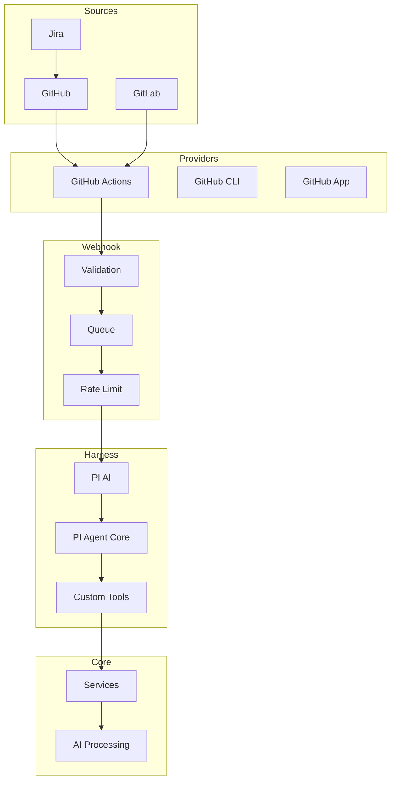

# labelit.ai

[](https://oxlint.github.io/)
[](https://github.com/rjoydip/labelit.ai/actions/workflows/ci.yml)
[](https://www.npmjs.com/package/labelit.ai)
[](https://opensource.org/licenses/MIT)
[](https://www.typescriptlang.org/)

## Overview

labelit.ai is a monolithic platform for processing webhook events from various sources (Jira, GitHub, GitLab) and applying AI-powered labeling to issues and pull requests. The system uses Cloudflare Workers for event ingestion and includes a unified harness for AI orchestration.

## Architecture


```mermaid
flowchart TD
    subgraph Sources
        BB[Jira]
        GH[GitHub]
        GL[GitLab]
    end

    subgraph Providers
        GHA[GitHub Actions]
        GHC[GitHub CLI]
        GHA2[GitHub App]
    end

    subgraph Harness
        PIA[PI AI]
        PIC[PI Agent Core]
        TOLS[Custom Tools]
    end

    subgraph Webhook
        VAL[Validation]
        QUE[Queue]
        RAT[Rate Limit]
    end

    subgraph Core
        SVC[Services]
        AI[AI Processing]
    end

    BB --> GH
    GH --> GHA
    GL --> GHA
    GHA --> VAL
    VAL --> QUE
    QUE --> RAT
    RAT --> PIA
    PIA --> PIC
    PIC --> TOLS
    TOLS --> SVC
    SVC --> AI
```

## Project Structure

```
labelit.ai/
├── src/
│   ├── harness/        # PI tools integration (Agent, streamSimple)
│   │   └── tools/      # Custom tool definitions for labeling
│   ├── providers/     # GitHub provider implementations
│   │   └── github/
│   │       ├── actions.ts  # GitHub Actions
│   │       └── app.ts     # GitHub App (JWT signing with Web Crypto API)
│   ├── webhook/       # Webhook handling
│   │   ├── handler.ts  # Webhook handler
│   │   ├── validation.ts  # Signature verification
│   │   ├── queue.ts    # Queue with retry logic
│   │   └── rate-limit.ts  # Rate limiting
│   ├── services/      # Core business logic
│   ├── ai/           # AI processing
│   ├── types/        # TypeScript types
│   ├── utils/        # Utility functions
│   └── config/       # Configuration
├── docs/             # Documentation
├── scripts/          # Utility scripts
├── package.json     # Single package.json
├── tsconfig.json    # Single tsconfig
└── webhook.ts       # Webhook entry point
```

## Getting Started

### Prerequisites

- [Bun](https://bun.sh/) (version 1.1.3 or later)
- Node.js 18+
- Git
- Cloudflare account (for deployment)

### Installation

1. Clone the repository:

   ```bash
   git clone https://github.com/yourusername/labelit.ai.git
   cd labelit.ai
   ```

2. Install dependencies:
   ```bash
   bun install
   ```

### Development

Run the development server:

```bash
bun run dev
```

### Available Scripts

- `bun run dev` - Start development server
- `bun run build` - Build for production (Cloudflare Workers)
- `bun run deploy` - Deploy to Cloudflare
- `bun run lint` - Lint code (oxlint)
- `bun run format` - Format code (oxfmt)
- `bun run test` - Run tests
- `bun run typecheck` - Type check

### Deployment

Secrets cannot be set directly in `wrangler.toml` for security. Use `wrangler secret put`:

```bash
wrangler secret put WEBHOOK_SECRET
wrangler secret put PI_API_KEY
wrangler secret put GITHUB_APP_PRIVATE_KEY
```

## GitHub Providers

labelit.ai supports three GitHub provider types:

| Provider           | Description                     | Authentication           |
| ------------------ | ------------------------------- | ------------------------ |
| **GitHub Actions** | For workflow-based automation   | `GITHUB_TOKEN`           |
| **GitHub CLI**     | For local development with `gh` | `gh auth`                |
| **GitHub App**     | For multi-repository access     | JWT + Installation token |

### Usage

```typescript
import { createGitHubProvider } from "./providers/github";

const provider = createGitHubProvider("actions", {
  token: process.env.GITHUB_TOKEN,
});

await provider.authenticate();
const issues = await provider.getIssues({ owner: "user", repo: "repo" });
```

## Webhook Configuration

Configure webhook validation and rate limiting:

```typescript
import { WebhookHandler, DEFAULT_CONFIG } from "./webhook";

const handler = new WebhookHandler(env);
const response = await handler.handle(request);
```

## Harness (PI Tools Integration)

The harness provides unified AI orchestration using PI tools:

```typescript
import { Harness } from "./harness";

const harness = new Harness({
  ai: {
    provider: "openai",
    apiKey: process.env.OPENAI_API_KEY,
    model: "gpt-4",
  },
});

const result = await harness.process(event);
```

## Technology Stack

- **Runtime**: Cloudflare Workers
- **Framework**: Hono
- **Package Manager**: Bun
- **Language**: TypeScript
- **AI Integration**: @earendil-works/pi-ai, @earendil-works/pi-agent-core
- **Linting**: oxlint
- **Formatting**: oxfmt
- **Testing**: Vitest

## Documentation

Additional documentation can be found in the `/docs` directory:

- [Architecture](docs/ARCHITECTURE.md)
- [Providers](docs/PROVIDERS.md) (coming soon)
- [Harness](docs/HARNESS.md) (coming soon)
- [Webhook Configuration](docs/WEBHOOK.md) (coming soon)

## Contributing

Please read [CONTRIBUTING.md](docs/CONTRIBUTING.md) for details on our code of conduct and the process for submitting pull requests.

## License

This project is licensed under the MIT License - see the [LICENSE](LICENSE) file for details.

## Acknowledgments

- Inspired by the need for automated issue labeling
- Built with Bun for optimal developer experience
- Utilizes Cloudflare Workers for scalable event processing
- Powered by PI tools for AI orchestration
